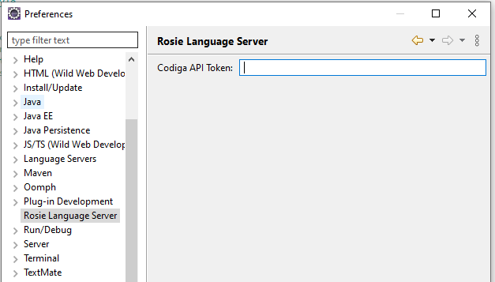

# Eclipse IDE plugin for the Rosie Language Server

Eclipse IDE plugin for integrating with Codiga's Rosie Language Server available at [Codiga/vscode-plugin](https://github.com/codiga/vscode-plugin/server).

## Configuration

If you have a Codiga Hub account registered, when you open `Window > Preferences > Rosie Language Server`,
you can specify your token, so you have access to your private rulesets.

 

## Outstanding issues

Diagnostics are not displayed in JavaScript files with .js extension, when the **Eclipse Java Web Developer Tools - JavaScript Support** plugin is installed.

It registers a content type called **JavaScript Source File** that we haven't been able to override with our content type. So, if you want Rosie analysis in .js files,
and you can live without the aforementioned plugin, please make sure to uninstall it.
